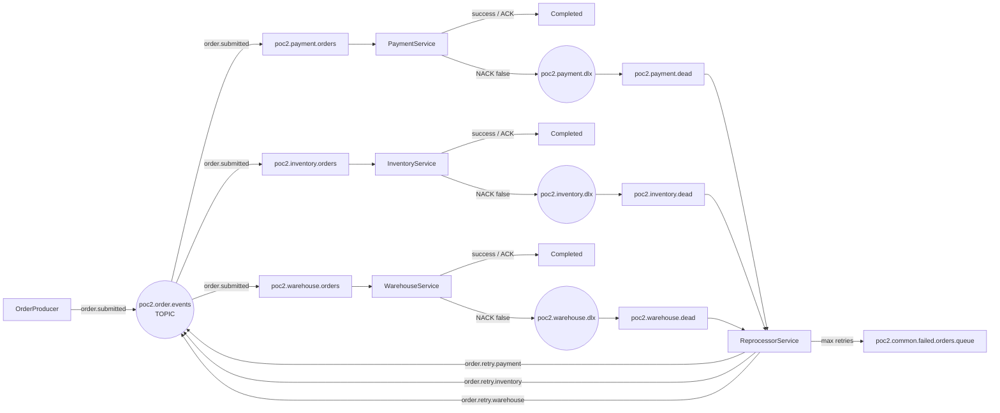

# .NET RabbitMQ Microservices POC 02 — Topic Routing + Retry & Recovery

A C#/.NET microservices proof of concept using **RabbitMQ.Client directly**, without MassTransit. This repository demonstrates how a RabbitMQ event flow can evolve from a simple fanout/DLQ foundation into a more controlled retry and recovery design using **topic routing keys**.

> **Repository:** `Net-RabbitMQ-Microservices-POC02-Retry-Recovery`
>
> **POC01:** `Net-RabbitMQ-Microservices-POC01-DLQ`

POC02 is intentionally self-contained. A reader can start here without reading POC01 first.

---

## 1. What this POC demonstrates

- .NET 10 / C# console-based microservices
- Direct `RabbitMQ.Client` usage
- A durable **topic exchange** for the main order event path
- Routing keys for initial events and service-specific retries
- Independent service queues
- Manual `BasicAck` / `BasicNack`
- Service-specific dead-letter exchanges (DLX)
- Service-specific dead-letter queues (DLQ)
- Deterministic 10-order demonstration batch
- Transient and permanent failure simulation
- Retry count using the RabbitMQ `x-retry-count` header
- `ReprocessorService` for bounded DLQ retry/recovery
- Service-specific retry routing instead of broadcasting retries to every service
- Common `poc2.common.failed.orders.queue` for messages that exhaust the permitted automatic retries
- Centralized runtime logging through `RabbitMQDemo.Logging`
- Enabled two-second service / three-second reprocessor delays for observing `Ready` and `Unacked` in RabbitMQ Management UI
- `prefetchCount=1` for easier live demonstration
- Environment-based RabbitMQ configuration for public-repository safety

---

## 2. Architecture at a glance



### The key POC02 improvement

The original POC01 main exchange is **fanout**. That is useful when the same event should be delivered to all interested service queues, and POC01 deliberately uses that simple model.

POC02 changes the **main event exchange to topic** so it can keep the broadcast behavior for the initial event while introducing explicit routing for retries:

```text
Initial event
    order.submitted
         |
         +--> poc2.payment.orders
         +--> poc2.inventory.orders
         +--> poc2.warehouse.orders

Payment retry
    order.retry.payment
         |
         +--> poc2.payment.orders only

Inventory retry
    order.retry.inventory
         |
         +--> poc2.inventory.orders only

Warehouse retry
    order.retry.warehouse
         |
         +--> poc2.warehouse.orders only
```

This avoids the POC01 limitation where a reprocessor publishing back to a fanout exchange could cause a retry to be delivered to all three service queues.

---

## 3. Why topic exchange in POC02?

POC01 intentionally uses a **single main fanout exchange** because the learning objective is to understand basic event broadcasting, independent queues, manual acknowledgements and DLQ behavior.

POC02 introduces routing keys because retry recovery creates a different requirement: **a failed payment operation should be retried by PaymentService, not by InventoryService and WarehouseService.**

A topic exchange provides that distinction without requiring the producer to publish three separate copies of the original event.

### POC02 routing contract

| Purpose | Exchange | Routing key | Destination |
|---|---|---|---|
| Original order event | `poc2.order.events` | `order.submitted` | All three service queues |
| Payment retry | `poc2.order.events` | `order.retry.payment` | `poc2.payment.orders` |
| Inventory retry | `poc2.order.events` | `order.retry.inventory` | `poc2.inventory.orders` |
| Warehouse retry | `poc2.order.events` | `order.retry.warehouse` | `poc2.warehouse.orders` |
| Payment DLQ | `poc2.payment.dlx` | `payment.dead` | `poc2.payment.dead` |
| Inventory DLQ | `poc2.inventory.dlx` | `inventory.dead` | `poc2.inventory.dead` |
| Warehouse DLQ | `poc2.warehouse.dlx` | `warehouse.dead` | `poc2.warehouse.dead` |

The first three rows are the important new POC02 routing behavior. The last three are service-specific DLX routing keys.

### POC02 topology names

```text
EXCHANGES
  poc2.order.events
  poc2.payment.dlx
  poc2.inventory.dlx
  poc2.warehouse.dlx

QUEUES
  poc2.payment.orders
  poc2.inventory.orders
  poc2.warehouse.orders

  poc2.payment.dead
  poc2.inventory.dead
  poc2.warehouse.dead

  poc2.common.failed.orders.queue
```

### Routing keys

```text
order.submitted
order.retry.payment
order.retry.inventory
order.retry.warehouse

payment.dead
inventory.dead
warehouse.dead
```

---

## 4. Why not keep fanout for retries?

With a fanout exchange, the routing key does not select a queue. Every queue bound to the exchange receives the published message.

That is appropriate for the original `OrderSubmitted` event in this demonstration, but it is undesirable for a targeted retry.

For example:

```text
PaymentService fails
       |
       v
poc2.payment.dead
       |
       v
ReprocessorService
       |
       | publish to fanout poc2.order.events
       v
Payment + Inventory + Warehouse queues
```

The retry can therefore be seen by services that were not responsible for the original failure.

POC02 changes the main exchange to topic:

```text
PaymentService fails
       |
       v
poc2.payment.dead
       |
       v
ReprocessorService
       |
       | order.retry.payment
       v
poc2.payment.orders only
```

This is the main architectural reason routing keys are introduced in POC02.

---

## 5. POC01 → POC02 progression

| Capability | POC01 | POC02 |
|---|:---:|:---:|
| Direct `RabbitMQ.Client` | Yes | Yes |
| Main exchange | Fanout | Topic |
| Routing keys in main event path | No | Yes |
| Independent service queues | Yes | Yes |
| Manual ACK/NACK | Yes | Yes |
| Service-specific DLX/DLQ | Yes | Yes |
| Deterministic 10-order batch | No | Yes |
| Explicit failure modes | Basic | Yes |
| Transient failure | No | Yes |
| Permanent failure | No | Yes |
| Retry count | No | Yes |
| ReprocessorService | No | Yes |
| Service-specific retry routing | No | Yes |
| Common `poc2.common.failed.orders.queue` | No | Yes |
| Centralized runtime logging | No | Yes |
| RabbitMQ UI visibility mode | No | Yes |

### Learning progression

```text
POC01
  |
  +--> Fanout exchange
  +--> Independent queues
  +--> ACK / NACK
  +--> DLX / DLQ
  |
  v
POC02
  |
  +--> Topic exchange
  +--> Routing keys
  +--> Targeted retries
  +--> Deterministic failure scenarios
  +--> Retry count
  +--> ReprocessorService
  +--> Common failed-orders queue
  +--> Centralized logging
  +--> RabbitMQ UI demonstration
```

---

## 6. Important RabbitMQ concept: same exchange name

If two services declare:

```csharp
await channel.ExchangeDeclareAsync(
    "poc2.order.events",
    ExchangeType.Topic,
    durable: true);
```

they are **not creating separate exchanges**. They are declaring the same RabbitMQ exchange name. RabbitMQ treats repeated compatible declarations as idempotent.

The exchange type must remain compatible. RabbitMQ will reject an attempt to redeclare an existing exchange with incompatible settings.

### Important when moving from POC01 to POC02

POC01 uses `order_exchange` as a **fanout** exchange. POC02 uses a new, explicitly named `poc2.order.events` exchange as a **topic** exchange.

If both POCs use the same RabbitMQ virtual host, you can remove the old POC01 `order_exchange` topology before starting POC02. The POC02-prefixed names also make the new topology easy to identify in the Management UI.

For a clean learning environment, purge/delete the old POC01 topology first. There is no need to delete the RabbitMQ Docker volume just to switch POCs.

---

## 7. Why not exchange-per-service?

Another valid architecture is to give each domain/service its own exchange:

```text
OrderService    -> order.exchange
PaymentService  -> payment.exchange
InventoryService -> inventory.exchange
WarehouseService -> warehouse.exchange
```

A service can then bind to another service's exchange when it needs that domain's events.

This can provide stronger domain ownership and isolation, but it also introduces more topology and exchange dependencies.

POC02 deliberately does **not** use exchange-per-service. The objective here is to demonstrate how a single shared event exchange can be made more selective with topic routing keys.

This is a design choice for the POC, not a statement that one topology is universally correct.

---

## 8. Message contract

Each order is published as JSON:

```json
{
  "OrderId": "ORD-1002",
  "Customer": "Bob",
  "Amount": 245.50,
  "FailureMode": "PaymentTransient"
}
```

The `FailureMode` field is intentionally included for the demonstration. It separates simulated test behavior from business fields such as customer and amount.

RabbitMQ retry metadata is carried separately in message headers:

```text
x-retry-count
x-retry-source
```

This keeps retry state out of the business message contract.

---

## 9. Deterministic demo batch

Press `ENTER` once in `OrderProducer` to publish the same 10-order scenario every time.

| Order | Failure mode | Expected behavior |
|---|---|---|
| `ORD-1001` | None | Success |
| `ORD-1002` | PaymentTransient | Payment fails twice → targeted retry → success |
| `ORD-1003` | None | Success |
| `ORD-1004` | InventoryTransient | Inventory fails twice → targeted retry → success |
| `ORD-1005` | WarehousePermanent | Retry limit → `poc2.common.failed.orders.queue` |
| `ORD-1006` | None | Success |
| `ORD-1007` | PaymentPermanent | Retry limit → `poc2.common.failed.orders.queue` |
| `ORD-1008` | None | Success |
| `ORD-1009` | WarehouseTransient | Warehouse fails twice → targeted retry → success |
| `ORD-1010` | None | Success |

The deterministic batch makes the demo repeatable and allows the reviewer to predict the expected RabbitMQ behavior before execution.

**POC02 boundary:** When the permitted automatic retries are exhausted, the message is moved to `poc2.common.failed.orders.queue`. POC02 ends at this queue. POC02 does not attempt further recovery from this queue; a future POC03 can introduce a separate failed-order reprocessing service.

---

## 10. Retry and recovery flow

### Transient failure

```text
ORD-1002
   |
   +--> Payment attempt 1 -> FAIL -> poc2.payment.dead
                                  |
                                  v
                         Reprocessor retry=1
                                  |
                                  | order.retry.payment
                                  v
                            poc2.payment.orders
                                  |
   +--> Payment attempt 2 -> FAIL -> poc2.payment.dead
                                  |
                                  v
                         Reprocessor retry=2
                                  |
                                  | order.retry.payment
                                  v
                            poc2.payment.orders
                                  |
   +--> Payment attempt 3 -> SUCCESS -> ACK
```

### Permanent failure

```text
ORD-1007
   |
   +--> Payment attempt 1 -> FAIL
   +--> retry=1 -> FAIL
   +--> retry=2 -> FAIL
   +--> retry=3 -> FAIL
                |
                v
        poc2.common.failed.orders.queue
```

The POC allows a maximum of 3 **retries after the original delivery**, which means a message can be processed up to 4 total times (original attempt + 3 retries). The exact transition is implemented by `ReprocessorService`.

---

## 11. What proves that an order was processed?

POC02 intentionally has no database. Processing completion is therefore demonstrated through the application and RabbitMQ message lifecycle:

```text
Consumer receives OrderId
        |
        v
Simulated business processing completes
        |
        v
BasicAckAsync()
        |
        v
RabbitMQ removes the message from the service queue
```

The shared runtime log records the lifecycle, including service, order ID, attempt and ACK/failure information.

This demonstrates **successful message consumption and acknowledgement**, not persistent business-state management. A production order system would normally persist business state or publish a processing-status event.

---

## 12. Centralized logging

POC02 uses one reusable logging class library:

```text
BuildingBlocks/
└── RabbitMQDemo.Logging/
    ├── DemoLogger.cs
    └── RabbitMQDemo.Logging.csproj
```

All five applications reference it:

```text
                 RabbitMQDemo.Logging
                         |
          +--------------+--------------+
          |       |       |       |      |
          v       v       v       v      v
       Producer Payment Inventory Warehouse Reprocessor
```

The runtime log is written to:

```text
logs/RabbitMQ-Demo.txt
```

The log is ignored by Git. A sanitized example is available under `docs/sample/`.

---

## 13. RabbitMQ Management UI connection names

Each application provides a human-readable RabbitMQ connection name so the **Connections** and **Channels** pages are easier to understand:

| Application | Client-provided connection name |
|---|---|
| OrderProducer | `POC2-OrderProducer` |
| PaymentService | `POC2-PaymentService` |
| InventoryService | `POC2-InventoryService` |
| WarehouseService | `POC2-WarehouseService` |
| ReprocessorService | `POC2-ReprocessorService` |

These names are operational labels only; they do not affect routing or queue behavior.

## 14. RabbitMQ Management UI demonstration

POC02 deliberately uses:

```csharp
await channel.BasicQosAsync(0, prefetchCount: 1, global: false);
```

This makes the `Unacked` state easier to observe.

Each service contains a clearly marked **two-second demonstration delay**:

```csharp
#region DEMO UI VISIBILITY - ENABLED DELAY
await Task.Delay(TimeSpan.FromSeconds(2));
#endregion
```

The reprocessor contains a **three-second retry delay**:

```csharp
#region DEMO UI VISIBILITY - ENABLED RETRY DELAY
await Task.Delay(TimeSpan.FromSeconds(3));
#endregion
```

These delays are intentionally enabled in this POC so the message lifecycle can be observed in the Management UI. They are demonstration aids, not production processing recommendations.

### What to observe

| RabbitMQ UI field | Meaning in this POC |
|---|---|
| Ready | Messages waiting in the queue |
| Unacked | Messages delivered to a consumer but not yet acknowledged |
| Total | Ready + Unacked |
| Consumers | Active consumers attached to the queue |
| Incoming | Messages entering the queue |
| Deliver / Get | Messages delivered/read |
| Ack | Messages acknowledged by consumers |

For retry demonstrations, watch the relevant service queue, its dead queue, and then the targeted retry queue movement through the topic exchange.

---

## 15. Fresh demo runbook

### Step 1 — RabbitMQ

Start RabbitMQ with the Management UI enabled.

This POC expects the configured AMQP endpoint, typically:

```text
localhost:5675
```

### Step 2 — clean old topology

If you previously ran POC01 using the same RabbitMQ virtual host, remove or purge the old POC01 topology if you want a clean Management UI demonstration. POC02 itself uses the distinct `poc2.order.events` exchange name.

For a clean demonstration, purge/delete the old POC01 queues and exchange, then let POC02 recreate them.

### Step 3 — start consumers

From the repository root:

```powershell
dotnet run --project .\PaymentService\PaymentService.csproj
dotnet run --project .\InventoryService\InventoryService.csproj
dotnet run --project .\WarehouseService\WarehouseService.csproj
dotnet run --project .\ReprocessorService\ReprocessorService.csproj
```

### Step 4 — start producer

```powershell
dotnet run --project .\OrderProducer\OrderProducer.csproj
```

Press `ENTER` once.

### Step 5 — observe

Watch three places together:

1. Service consoles
2. `logs/RabbitMQ-Demo.txt`
3. RabbitMQ Management UI

Expected final result:

```text
poc2.common.failed.orders.queue
    |
    +--> ORD-1005
    +--> ORD-1007
```

Transient failures should recover through **service-specific routing keys**.

---

## 16. Public repository configuration

RabbitMQ connection settings are loaded from `.env`:

```env
RABBITMQ_HOST=localhost
RABBITMQ_PORT=5675
RABBITMQ_USERNAME=<local-demo-user>
RABBITMQ_PASSWORD=<local-demo-password>
```

The actual `.env` file is intentionally ignored by Git. Commit `.env.example`, not real credentials.

Never commit production, cloud, shared-environment or personal credentials to a public repository.

---

## 17. Technology stack

| Technology | Usage |
|---|---|
| .NET 10 | Application runtime |
| C# | Microservice implementation |
| RabbitMQ 4.x | Message broker |
| RabbitMQ.Client 7.2.2 | Direct AMQP client |
| DotNetEnv 3.2.0 | Local environment configuration |
| Docker | Local RabbitMQ infrastructure can be containerized |
| RabbitMQ Management UI | Queue/exchange/message observation |
| JSON | Order message payload |
| Shared class library | Centralized demo logging |

No MassTransit is used. No database is used. No HTTP API is required.

---

## 18. Project structure

```text
.
├── BuildingBlocks/
│   └── RabbitMQDemo.Logging/
│       ├── DemoLogger.cs
│       └── RabbitMQDemo.Logging.csproj
├── OrderProducer/
│   ├── OrderProducer.cs
│   └── OrderProducer.csproj
├── PaymentService/
│   ├── PaymentService.cs
│   └── PaymentService.csproj
├── InventoryService/
│   ├── InventoryService.cs
│   └── InventoryService.csproj
├── WarehouseService/
│   ├── WarehouseService.cs
│   └── WarehouseService.csproj
├── ReprocessorService/
│   ├── ReprocessorService.cs
│   └── ReprocessorService.csproj
├── docs/
│   ├── architecture.md
│   ├── architecture.html
│   └── sample/
│       └── RabbitMQ-Demo-sample.txt
├── .env.example
├── .gitignore
├── BUILD_VERIFICATION.md
├── LICENSE
├── PUBLIC_REPOSITORY_CHECKLIST.md
├── README.md
└── ECommerceAppPoc2.slnx
```

---

## 19. Explanation

> "The producer publishes an OrderSubmitted event using the `order.submitted` routing key to a durable topic exchange. The three service queues are independently bound to that key, so the original order event is delivered to Payment, Inventory and Warehouse. Each service uses manual acknowledgement. On processing failure it sends NACK with `requeue=false`, allowing RabbitMQ to dead-letter the message to the service-specific DLQ. ReprocessorService consumes the DLQs, increments `x-retry-count`, and republishes using a service-specific retry routing key such as `order.retry.payment`. The topic exchange routes that retry only to the affected service queue. After the configured retry limit, the message is moved to `poc2.common.failed.orders.queue`. POC02 ends at this queue; further failed-order recovery is intentionally left for a future POC03."

---

## 20. Deliberately simplified / deliberately added

### Deliberately simplified

- Console applications instead of ASP.NET APIs
- No database
- No authentication/authorization
- No distributed tracing platform
- No external monitoring stack
- No production retry scheduler
- No exponential backoff
- No idempotency store
- Simulated failures instead of real payment/inventory/warehouse integrations

### Deliberately added

- Topic exchange and routing keys
- Service-specific retry routing
- Deterministic failure scenarios
- Retry count header
- ReprocessorService
- Common failed-orders queue
- Centralized logging
- RabbitMQ UI visibility mode
- Public-repository-safe environment configuration

These choices keep the POC focused on messaging and reliability mechanics while providing a clear path toward more production-oriented patterns.

---

## 21. Next possible evolution

A future POC can extend this design with:

```text
POC02
  |
  +--> Topic routing
  +--> Targeted retries
  +--> Bounded DLQ retry
  |
  v
POC03
  |
  +--> Consume `poc2.common.failed.orders.queue`
  +--> Dedicated failed-order reprocessing service
  +--> Correlation ID
  +--> Idempotency
  +--> Exponential backoff
  +--> Delayed retry / scheduler
  +--> Outbox pattern
  +--> Structured observability
  +--> Service-owned/domain exchanges
```

The purpose is to make each repository demonstrate a clear architectural step rather than placing every RabbitMQ feature into one application.

---

## License

MIT — see [`LICENSE`](LICENSE).
