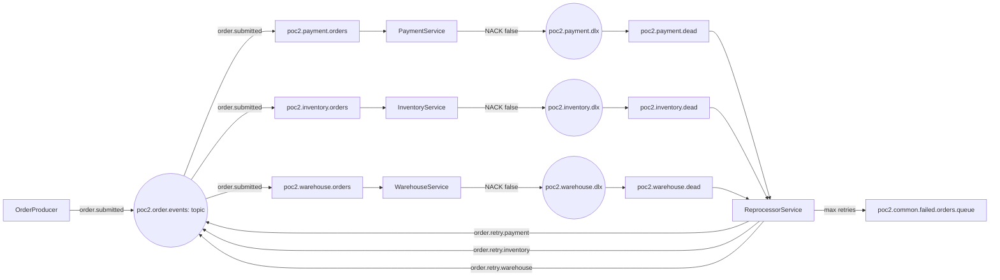

# POC 02 — Technical Architecture

This document explains the messaging topology, routing decisions, retry flow and operational demonstration behavior used by POC02. It is technical documentation and is independent of any personal portfolio website.

## 1. Architecture objective

POC02 evolves a basic RabbitMQ fanout/DLQ implementation into a retry/recovery design where retries can be routed back to the service that originally failed.

The central architectural change is:

```text
POC01                         POC02
------                        ------
order_exchange fanout     ->    poc2.order.events topic
routing key ignored       ->    routing key selects retry destination
retry broadcast           ->    retry targeted to service queue
```

## 2. Main topology



## 3. Exchange design

### Main exchange

`poc2.order.events` is a durable **topic** exchange in POC02.

The original order event is published with:

```text
order.submitted
```

All three service queues have a binding for that routing key.

### Service retry bindings

Each service queue has a second, service-specific binding:

| Queue | Initial binding | Retry binding |
|---|---|---|
| `poc2.payment.orders` | `order.submitted` | `order.retry.payment` |
| `poc2.inventory.orders` | `order.submitted` | `order.retry.inventory` |
| `poc2.warehouse.orders` | `order.submitted` | `order.retry.warehouse` |

This is the key POC02 routing design.

## 4. Why topic instead of fanout?

POC01 uses fanout because its primary learning objective is event broadcast. The same order event is copied to the independent payment, inventory and warehouse queues.

POC02 needs an additional capability: targeted retry.

A fanout exchange cannot use the routing key to select one bound queue. Therefore, publishing a retry to the fanout exchange can cause all service queues to receive the retry.

A topic exchange allows both behaviors in the same exchange:

```text
order.submitted
      |
      +--> poc2.payment.orders
      +--> poc2.inventory.orders
      +--> poc2.warehouse.orders

order.retry.payment
      |
      +--> poc2.payment.orders
```

This is a deliberate POC design decision. It does not mean topic exchanges are universally preferable to fanout exchanges.

## 5. Why not exchange-per-service?

An exchange-per-service/domain design is another valid architecture:

```text
order.exchange
payment.exchange
inventory.exchange
warehouse.exchange
```

It can provide strong ownership boundaries and isolation, but it creates more exchanges and cross-domain bindings.

POC02 deliberately demonstrates a different approach: a shared event exchange with explicit topic routing. A later POC can demonstrate service/domain-owned exchanges and compare the operational trade-offs.

## 6. Same exchange name and idempotent declaration

Multiple applications may safely declare the same exchange during startup when the declarations are compatible:

```csharp
await channel.ExchangeDeclareAsync(
    "poc2.order.events",
    ExchangeType.Topic,
    durable: true);
```

They are not creating separate exchanges. RabbitMQ identifies an exchange by its name within the virtual host.

The exchange type is part of the declaration contract. POC01 uses `order_exchange` as `fanout`, while POC02 uses the separately named `poc2.order.events` as `topic`. RabbitMQ does not allow an existing exchange to be silently changed from one type to another.

If both POCs use the same virtual host, the old POC01 topology can be removed before starting POC02. Because POC02 uses a distinct `poc2.*` naming convention, the new topology is also easy to identify in the Management UI.

## 7. DLX/DLQ design

Each service queue has its own dead-letter exchange and dead-letter queue:

| Service | Queue | DLX | DLQ | DLX routing key |
|---|---|---|---|---|
| Payment | `poc2.payment.orders` | `poc2.payment.dlx` | `poc2.payment.dead` | `payment.dead` |
| Inventory | `poc2.inventory.orders` | `poc2.inventory.dlx` | `poc2.inventory.dead` | `inventory.dead` |
| Warehouse | `poc2.warehouse.orders` | `poc2.warehouse.dlx` | `poc2.warehouse.dead` | `warehouse.dead` |

The DLX exchanges are direct exchanges because each service has a single intended dead-letter destination in this POC.

### Named topology

```text
EXCHANGES
  poc2.order.events
  poc2.payment.dlx
  poc2.inventory.dlx
  poc2.warehouse.dlx

QUEUES
  poc2.payment.orders
  poc2.inventory.orders
  poc2.warehouse.orders

  poc2.payment.dead
  poc2.inventory.dead
  poc2.warehouse.dead

  poc2.common.failed.orders.queue
```

### Routing keys

```text
order.submitted
order.retry.payment
order.retry.inventory
order.retry.warehouse

payment.dead
inventory.dead
warehouse.dead
```

## 8. Retry routing

ReprocessorService determines the originating service from the DLQ it is consuming:

```text
poc2.payment.dead   -> order.retry.payment
poc2.inventory.dead -> order.retry.inventory
poc2.warehouse.dead -> order.retry.warehouse
```

The reprocessor then publishes to `poc2.order.events` using that routing key.

This is preferable to publishing with an empty routing key to a fanout exchange for the retry path because only the affected service queue is bound to the corresponding retry key.

## 9. Retry state

The retry count is carried in a RabbitMQ message header:

```text
x-retry-count
```

The lifecycle is:

```text
0 -> original delivery
1 -> first reprocessor retry
2 -> second reprocessor retry
3 -> third reprocessor retry
>=3 at ReprocessorService -> poc2.common.failed.orders.queue
```

The business JSON does not contain retry state.

## 10. Message contract

```json
{
  "OrderId": "ORD-1002",
  "Customer": "Bob",
  "Amount": 245.50,
  "FailureMode": "PaymentTransient"
}
```

`FailureMode` is a deterministic simulation field. It allows the demo to reproduce transient and permanent failure behavior without external dependencies.

## 11. Message lifecycle

### Successful order

```text
order.submitted
      |
      v
 topic exchange
      |
      +--> service queue
              |
              v
          consumer
              |
              v
        simulated processing
              |
              v
             ACK
              |
              v
        message removed
```

### Failed order

```text
service queue
      |
      v
   consumer
      |
      | failure
      v
NACK(requeue=false)
      |
      v
     DLX
      |
      v
     DLQ
      |
      v
ReprocessorService
```

### Retry

```text
ReprocessorService
      |
      | increment x-retry-count
      |
      | service-specific routing key
      v
poc2.order.events (topic)
      |
      v
affected service queue only
```

## 12. Common failed-orders queue

When the retry count reaches the configured maximum:

```text
DLQ
 |
 v
ReprocessorService
 |
 +--> x-final-status=failed
 +--> x-failed-source-queue=<source>
 |
 v
poc2.common.failed.orders.queue
```

`poc2.common.failed.orders.queue` is the common failed-orders queue for messages that exhaust the permitted automatic retries. POC02 ends at this queue. It is intentionally not reprocessed again within POC02; a future POC03 can introduce a separate failed-order recovery/reprocessing service.

## 13. Processing evidence

POC02 intentionally does not persist order state in a database. The evidence chain is therefore:

```text
OrderId received
      |
      v
Business simulation completes
      |
      v
BasicAckAsync
      |
      v
RabbitMQ removes message
```

The centralized runtime log records the order ID, attempt, success/failure and ACK information.

This demonstrates message processing and acknowledgement. It does not claim to be persistent business-state tracking.

## 14. Centralized logging

The shared library is:

```text
BuildingBlocks/RabbitMQDemo.Logging/
```

All five applications reference it and write to:

```text
logs/RabbitMQ-Demo.txt
```

The runtime log is ignored by Git. `docs/sample/RabbitMQ-Demo-sample.txt` contains sanitized representative output.

## 15. RabbitMQ Management UI connection names

Each application sets `ConnectionFactory.ClientProvidedName` so RabbitMQ Management UI shows a meaningful connection name instead of only an IP/port endpoint:

| Application | Connection name |
|---|---|
| OrderProducer | `POC2-OrderProducer` |
| PaymentService | `POC2-PaymentService` |
| InventoryService | `POC2-InventoryService` |
| WarehouseService | `POC2-WarehouseService` |
| ReprocessorService | `POC2-ReprocessorService` |

The name is for operational identification and has no effect on exchange, queue or routing behavior.

## 16. RabbitMQ UI demonstration

All relevant consumers use:

```csharp
BasicQosAsync(0, prefetchCount: 1, global: false)
```

The service-side two-second delay and reprocessor three-second delay are intentionally enabled under explicit `DEMO UI VISIBILITY` regions. This makes `Ready -> Unacked -> ACK` and DLQ -> Reprocessor movement visible in the Management UI during the experiment.

These settings allow a reviewer to observe:

```text
READY
  |
  v
UNACKED
  |
  v
ACK
  |
  v
removed
```

The delay is purely a demonstration aid and should not be interpreted as a production processing strategy.

## 17. Local topology reset when switching from POC01

POC01 and POC02 use different main exchange names and therefore can coexist. If you want a clean Management UI for the POC02 demonstration, remove or purge the old POC01 topology first.

Recommended learning workflow:

```text
POC01
  |
  +--> finish demonstration
  |
  +--> remove/purge POC01 topology
  |
  v
POC02
  |
  +--> topic exchange declared
  +--> service queues declared
  +--> retry bindings declared
```

Using a separate RabbitMQ virtual host for each POC is another clean option when both topologies need to coexist.

## 18. Public repository considerations

RabbitMQ credentials are loaded from `.env` and `.env` is ignored by Git. `.env.example` contains placeholders only.

No real production/shared credentials should be committed to the public repository.

## 19. Future evolution

A future POC can add:

- Correlation IDs
- Idempotency
- Exponential backoff
- Delayed retry/scheduler
- Outbox pattern
- Structured observability
- Service/domain-owned exchanges
- More explicit event contracts

POC02 intentionally stops before these concerns so the routing/retry mechanics remain easy to demonstrate.
